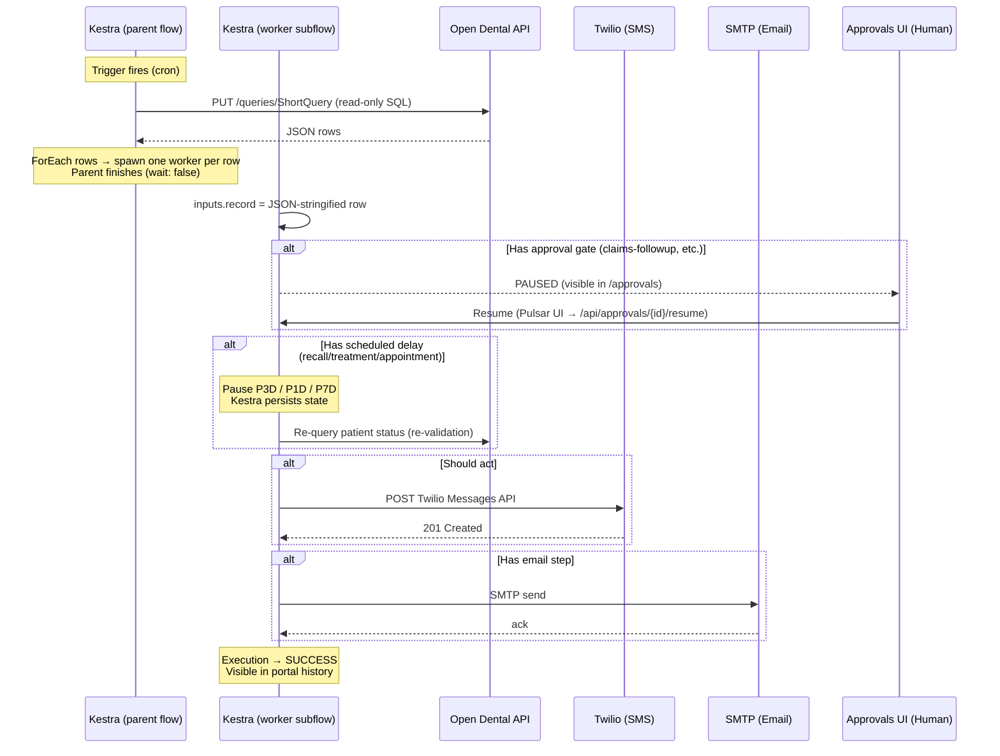

# Execution Flow

> End-to-end: scheduled trigger → HTTP query → ForEach → per-row worker → optional pause → resume → action(s).

This page describes what happens **inside Kestra** for a single row. For the cross-system flow (UI click → resume → Twilio), see [[System Overview]] §2.

## Sequence

## Key invariants

1. **One execution per row.** The parent flow fans out via `ForEach`; each row is its own worker execution. This makes Approve/Reject in the UI unambiguous (Kestra OSS 0.19.x ignores `taskRunId` on resume — see [[System Overview]] §2).

2. **Re-validate after pause.** After any delay or human approval, the worker re-queries the data source to check if the situation resolved (e.g., the patient already booked, the claim was paid). This prevents stale actions.

3. **Namespace isolation.** Each clinic runs in its own Kestra namespace (`dental.<slug>`) with separate KV variables, secrets, and execution history. See [[Tenant Isolation]].

4. **At-least-once semantics.** Workflow templates that need stronger dedup pair the action with a per-clinic `dental_automation_log` lookup (see [[Correlation Key]]).

## Trigger types

| Trigger | When to use | Notes |
|---------|------------|-------|
| `io.kestra.plugin.core.trigger.Schedule` (cron) | Default for every generated workflow | The orchestrator fills in cron from `flowcore.workflows.triggerCron`. |
| `io.kestra.plugin.core.trigger.Webhook` | Manual / event-driven workflows | Used when `actionMode = manual`. |

JDBC polling triggers are not used — per [[ADR-009 Open Dental API over Direct MySQL]], data-source reads happen as HTTP requests inside the parent flow, not as the trigger itself.

## Task types used

| Kestra Task | Purpose |
|-------------|---------|
| `io.kestra.plugin.core.http.Request` | Open Dental ShortQuery API; Twilio Messages API |
| `io.kestra.plugin.notifications.mail.MailSend` | Email via SMTP |
| `io.kestra.plugin.core.flow.Pause` | Delay (with `delay`) or human approval (no `delay`) |
| `io.kestra.plugin.core.flow.If` | Conditional branching (e.g., "if email present") |
| `io.kestra.plugin.core.flow.Switch` | Multi-way branching |
| `io.kestra.plugin.core.flow.ForEach` | Iterate over query result rows in the parent |
| `io.kestra.plugin.core.flow.Subflow` | Spawn the per-row worker execution |
