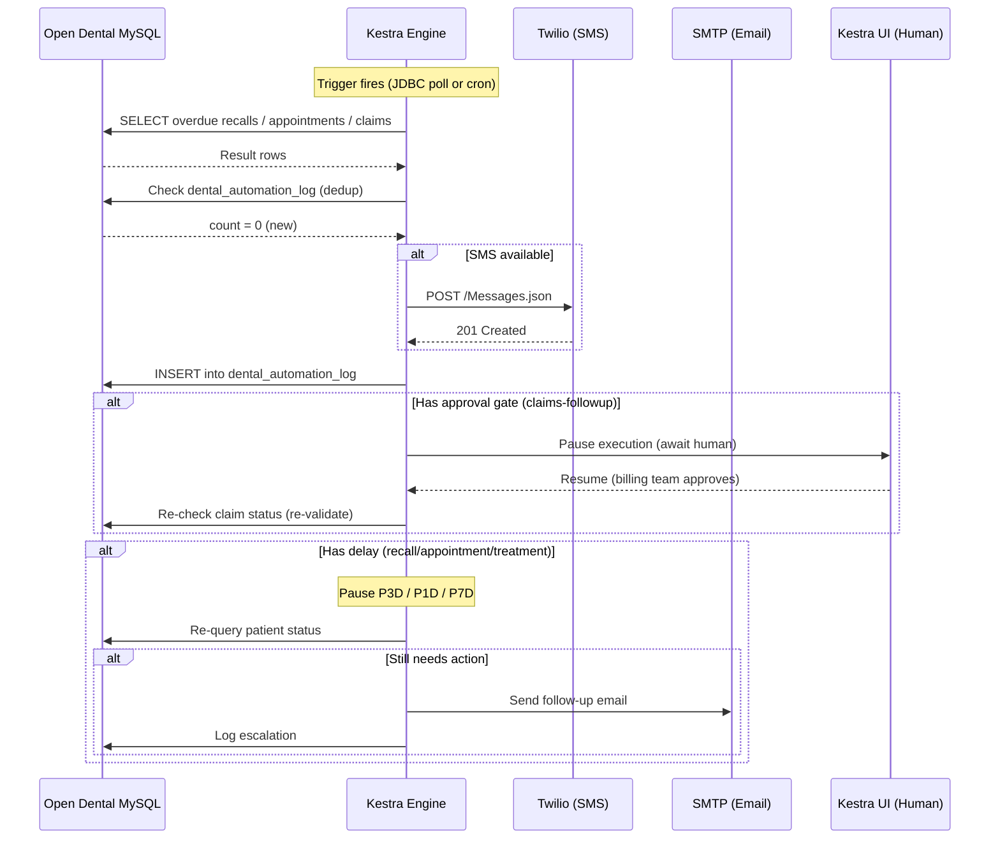

# Execution Flow

> End-to-end: Kestra trigger → dedup check → actions → pause/resume → re-validate → escalate.

## Sequence

## Key invariants

1. **Dedup first.** Every flow checks `dental_automation_log` before acting. A patient won't receive duplicate outreach within the configured window.

2. **Re-validate after pause.** After any delay or human approval, the flow re-queries Open Dental to check if the situation resolved. This prevents stale actions.

3. **Namespace isolation.** Each clinic runs in its own Kestra namespace with separate KV variables, secrets, and execution history.

4. **At-least-once semantics.** The dedup table mitigates duplicate sends on engine restart.

## Trigger types

| Trigger | Flows | Interval |
|---------|-------|----------|
| JDBC MySQL poll | recall-reminder, claims-followup, treatment-followup | PT5M to P1D |
| Cron schedule | appointment-reminder | 7am daily |

## Task types used

| Kestra Task | Purpose |
|-------------|---------|
| `io.kestra.plugin.jdbc.mysql.Trigger` | Poll Open Dental tables |
| `io.kestra.plugin.jdbc.mysql.Query` | Dedup check, re-validation, audit log insert |
| `io.kestra.plugin.core.http.Request` | Twilio SMS API |
| `io.kestra.plugin.notifications.mail.MailSend` | Email via SMTP |
| `io.kestra.plugin.core.flow.Pause` | Delay (with duration) or human approval (no duration) |
| `io.kestra.plugin.core.flow.If` | Conditional branching |
| `io.kestra.plugin.core.flow.Switch` | Multi-way branching |
| `io.kestra.plugin.core.flow.ForEach` | Iterate over query result rows |
